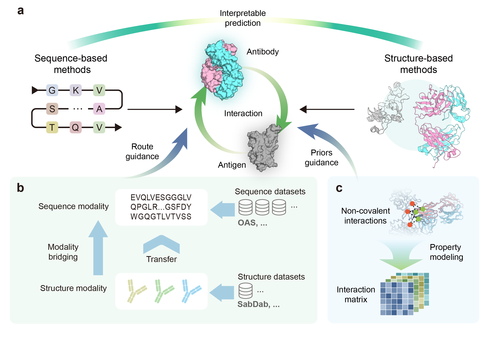

# S3AI
The official code repository of ["Interpretable antibody-antigen interaction prediction by bridging structure to sequence"](https://www.biorxiv.org/content/10.1101/2024.03.09.584264v1).

## Table of Contents
- [Overview](#overview)
- [Installation](#installation)
- [Data](#data)
- [Model inference](#model-inference)
- [Model training](#model-training)
- [License](#license)

## Overview
## Installation

We highly recommand that you use Anaconda for Installation
```
conda create -n S3AI
conda activate S3AI
pip install -r requirements.txt
```

## Data
The SARS-CoV-2 IC50 data is in the `data` folder.
* `data/updated_processed_data.csv` is the paired Ab-Ag data.
* `data/Ag_sequence.csv` is the Ag sequence data.

## Model inference 
### Download checkpoint
Download the checkpoint of S3AI and modify the paths in the code.
| Content  | Link   |
| ----- | ----- |
| Checkpoint on SARS-CoV-2 | [link](https://figshare.com/ndownloader/files/44970310) |
| Checkpoint on HIV cls | [link]() |
| Checkpoint on HIV reg | [link]() |

To test S3AI on SARS-CoV-2 IC50 test data, please run
```
python main.py --config=configs/test_on_sarscov2.yml
```

To test S3AI on HIV test data for classification, please run
```
python main.py --config=configs/test_on_HIV_cls.yml
```

To test S3AI on HIV test data for regression, please run
```
python main.py --config=configs/test_on_HIV_reg.yml
```

## Model training
To train S3AI on downstream task from scratch, please run
```
python main.py --config=configs/train.yml
```

## License

This project is licensed under the [MIT License](LICENSE).

